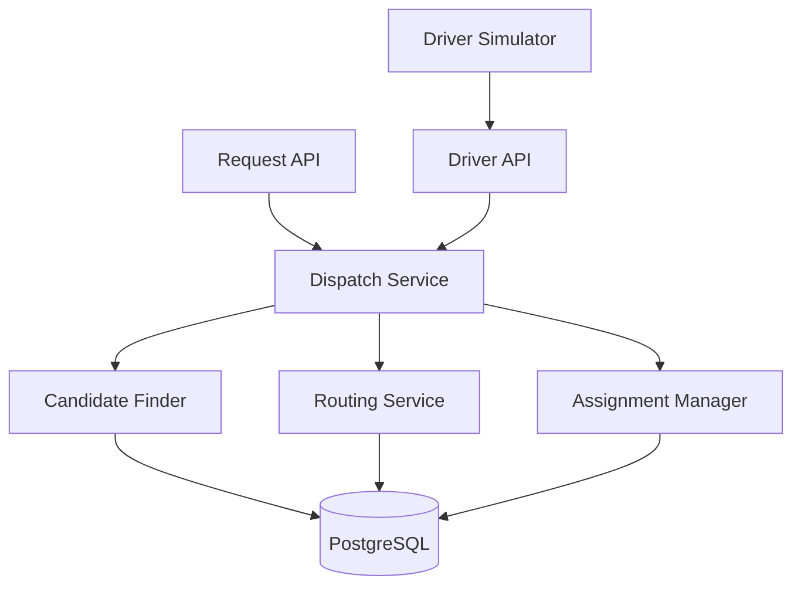
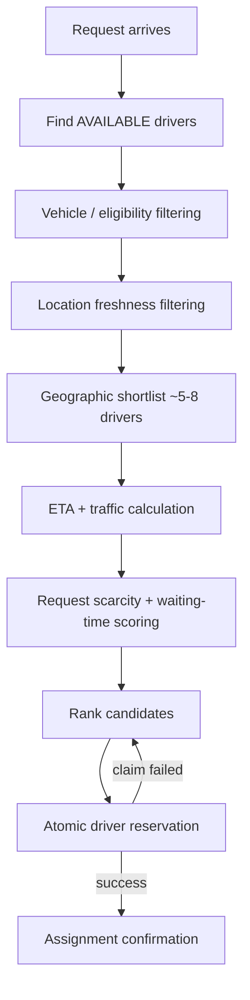
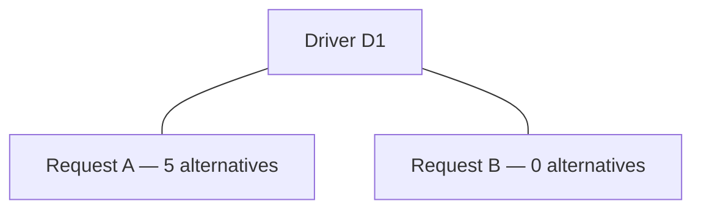
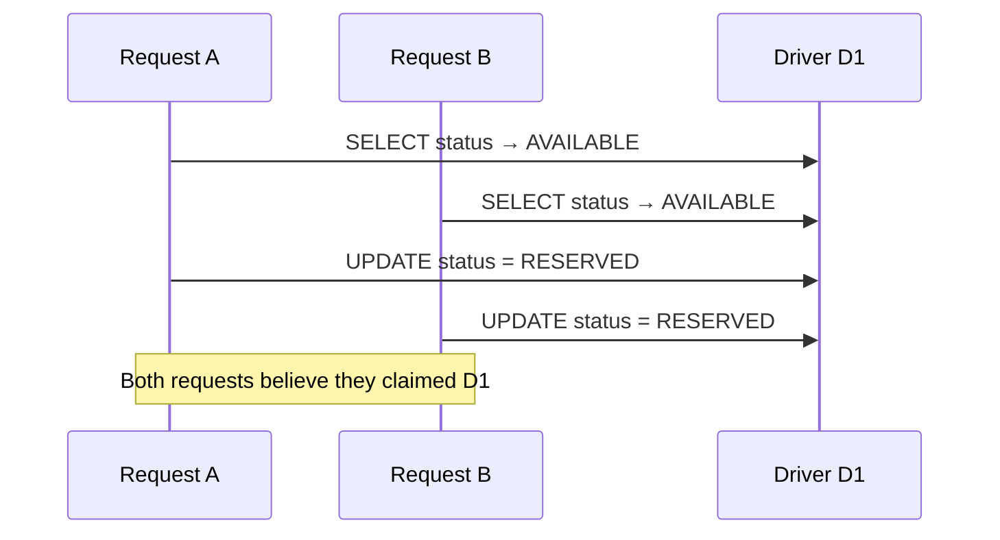
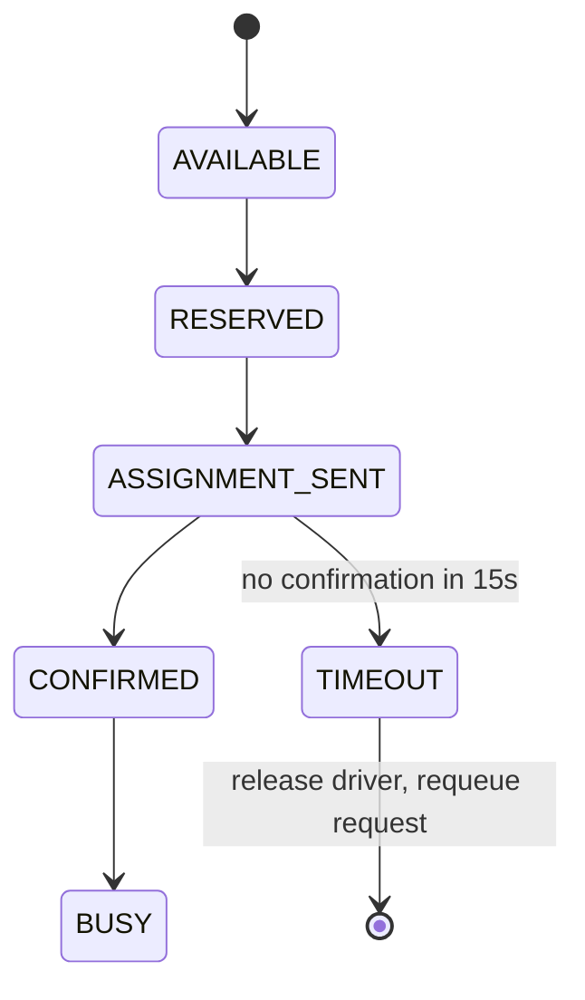

# Dispatch Matching Service

**Real-time driver-to-request dispatch for a ride-hailing/delivery platform** — concurrency-safe assignment, ETA/traffic-aware matching, stale-location handling, and automatic reassignment on driver failure.

> 📄 For the full engineering rationale behind these decisions, see **[docs/DESIGN.md](docs/DESIGN.md)**.

| | |
|---|---|
| **Status** | Day 1 — Initial Architecture Submission |
| **Implementation status** | Architecture and design phase. Application code will be built during the remaining training period per the [roadmap](#roadmap) below. |
| **Stack** | Java 17+, Spring Boot, PostgreSQL, Flyway, Testcontainers |

No application code, screenshots, or test results are claimed in this document unless explicitly marked as implemented. Everything described here is a design commitment for the five-day build.

---

## Table of Contents

1. [Problem](#problem)
2. [Solution](#solution)
3. [Key Assumptions](#key-assumptions)
4. [Architecture](#architecture)
5. [Matching Logic](#matching-logic)
6. [Reliability](#reliability)
7. [API Overview](#api-overview)
8. [Technology Stack](#technology-stack)
9. [Setup and Run Instructions](#setup-and-run-instructions)
10. [Testing](#testing)
11. [Scope](#scope)
12. [Roadmap](#roadmap)
13. [Future Improvements](#future-improvements)

---

## Problem

Matching a ride/delivery request to a driver looks simple — "find the nearest driver" — but at any real scale it is a **concurrent resource-allocation problem**, not a lookup:

- Driver availability changes continuously.
- Driver locations are a potentially **stale** snapshot, not ground truth.
- Multiple requests can compete for the **same driver** at the same time.
- A selected driver can **disappear** before confirming.

Naively assigning the "closest" driver with a simple read-then-write is unsafe under concurrency, and ignoring traffic conditions produces poor ETAs even when the distance calculation is correct.

## Solution

This service treats dispatch as an allocation problem with three explicit priorities, in order:

1. **Correctness** — never double-assign a driver.
2. **Liveness** — a request must never get stuck indefinitely.
3. **Matching quality** — prefer ETA/traffic-aware selection over raw distance.

Concretely, the engineering goals are:

- Prevent double-assignment under concurrent requests.
- Make reasonable decisions using potentially stale driver locations.
- Select drivers using ETA and traffic-aware information rather than distance alone.
- Automatically recover when a reserved driver fails to confirm.
- Maintain good matching quality without introducing unnecessary matching latency.

---

## Key Assumptions

These are **configurable project assumptions** scoped for a five-day training project, not universal industry standards.

**Location freshness**

| Location age | Classification | Matching behavior |
|---|---|---|
| < 10 seconds | `FRESH` | Normal eligibility |
| 10–30 seconds | `SLIGHTLY_STALE` | Eligible, with a ranking penalty |
| > 30 seconds | `TOO_STALE` | Normally excluded |

The system does not require perfectly fresh GPS data — freshness becomes a **confidence factor** in the matching decision rather than a hard cutoff.

**Assignment confirmation** — a driver has **15 seconds** to confirm an assignment after being reserved. This is intentionally short for demonstration/testing and will be configurable.

**Candidate shortlist** — matching runs in two stages: cheap geographic filtering narrows the pool to ~5–8 nearest eligible drivers, and the more expensive ETA/traffic scoring only runs on that shortlist. Shortlist size is configurable.

**Traffic and ETA** — a `RoutingService` abstraction supplies ETA and traffic data. The initial implementation uses a deterministic mock with simulated traffic factors:

| Traffic condition | Travel-time factor |
|---|---|
| `LOW` | 1.0× |
| `MODERATE` | 1.25× |
| `HIGH` | 1.6× |

The project does **not** scrape or call a real maps/traffic API. The abstraction lets a real provider be plugged in later without touching the dispatch engine.

**Driver simulation** — drivers and location updates are generated by a standalone simulator rather than real GPS/mobile clients, as permitted by the project brief.

**Deployment** — single region, one Spring Boot application, one PostgreSQL database, no distributed locking, no geo-sharding. This keeps the concurrency model simple enough to reason about and test within the project timeframe.

---

## Architecture

Modular monolith: one Spring Boot application, one PostgreSQL database.



**Module structure**

```
backend/
├── controller/   # REST endpoints and DTO handling
├── service/      # DispatchService, DriverService, AssignmentService,
│                 # RoutingService, ReassignmentService
├── repository/   # persistence operations
├── entity/       # Driver, Vehicle, RideRequest, Assignment
├── dto/          # API request/response models
├── exception/    # domain exceptions and global error handling
├── config/       # configurable thresholds and scoring weights
└── simulation/   # standalone driver/request simulation
```

Responsibilities stay separate so the matching engine can evolve without coupling API, persistence, and routing concerns. See [DESIGN.md § Architecture](docs/DESIGN.md#2-architecture) for why a modular monolith was chosen over a distributed design.

---

## Matching Logic

Two-stage pipeline: cheap filtering first, expensive scoring only on the shortlist.



**Stage 1 — Geographic filtering.** Cheap filtering using driver coordinates and pickup location: Haversine distance and/or a bounding-box filter identify nearby candidates. Only the nearest ~5–8 eligible drivers proceed.

**Stage 2 — ETA-aware scoring.** Shortlisted drivers are scored on: estimated arrival time, traffic conditions, distance, location freshness, vehicle compatibility, request scarcity, and request waiting time. The goal is to avoid picking a driver purely because they're geographically closest:

| Driver | Distance | Traffic | ETA | Selected? |
|---|---|---|---|---|
| A | 2 km | HIGH | 14 min | |
| B | 3.5 km | LOW | 8 min | ✅ Preferred |

**Request scarcity.** When multiple requests compete for the same driver, the system weighs how many *other* viable drivers each request has:



Request B can receive higher priority because it has fewer practical alternatives — this stops the system from treating every request as equally replaceable. Scarcity is a **secondary** scoring signal: it never overrides the concurrency guarantee (below). Scoring decides *priority*; the atomic database claim decides *what actually gets assigned*.

**Waiting-time protection.** Waiting time contributes a configurable priority boost, so a request doesn't lose indefinitely to a stream of newer, slightly-better-scored requests — basic starvation protection, kept simple enough to explain and test.

---

## Reliability

### 🔒 Concurrency Safety

The single most important correctness requirement in this project:

> **Two simultaneous requests must never be assigned to the same driver.**

A naive read-then-write is unsafe:



**Chosen solution — atomic conditional update**, performed as a single database statement:

```sql
UPDATE driver
SET status = 'RESERVED'
WHERE id = :driverId
AND status = 'AVAILABLE';
```

The application checks the affected-row count:

| Rows affected | Meaning | Action |
|---|---|---|
| `1` | Reservation succeeded | Proceed to assignment |
| `0` | Driver already claimed/changed | Try the next-ranked candidate |

This places the correctness guarantee **at the database/transaction level**, not on application-side synchronization — the ranking algorithm decides preference, the database decides truth.

### 🔁 Stale Locations

Handled via the freshness thresholds in [Key Assumptions](#key-assumptions): fresh locations rank normally, slightly-stale locations are penalized but still eligible, and too-stale locations are normally excluded. This lets the system tolerate minor GPS/communication delays without treating every late update as a hard failure.

### ⏱️ Timeout and Automatic Reassignment

A reserved driver can disappear before confirming. The assignment lifecycle:



On timeout: the driver is released, the request is requeued, and matching runs again — bounded by a configurable retry policy so a request can't loop forever. **Late confirmations racing with a timeout are handled with conditional state transitions**, so a confirmation that arrives just after expiry cannot resurrect an already-expired assignment.

---

## API Overview

| Method | Endpoint | Purpose |
|---|---|---|
| `POST` | `/drivers/{id}/location` | Update driver latitude, longitude, and location timestamp |
| `PATCH` | `/drivers/{id}/status` | Update driver status (`AVAILABLE`, `RESERVED`, `BUSY`, `OFFLINE`, `DISCONNECTED`) |
| `POST` | `/requests` | Create a ride/delivery request; triggers matching |
| `GET` | `/requests/{id}` | Get request state and assignment info |
| `POST` | `/assignments/{id}/confirm` | Driver confirms a reservation |

Detailed request/response schemas will be added during implementation. See [DESIGN.md § API Contract](docs/DESIGN.md#10-api-contract) for the DTO-boundary rationale.

---

## Technology Stack

| Category | Choices |
|---|---|
| Backend | Java 17+, Spring Boot, Spring Data JPA / JDBC where appropriate, Maven |
| Database | PostgreSQL, Flyway |
| Testing | JUnit, Spring Boot Test, Testcontainers, PostgreSQL integration testing |
| Simulation | Python or Java standalone simulator |
| Version control | Git, GitHub |

---

## Setup and Run Instructions

> These are **planned** instructions for the implementation phase and are not claimed to be functional in this Day-1 submission.

**Prerequisites:** Java 17+, Maven, PostgreSQL 15+, Python 3.10+ (if Python is chosen for the simulator), Git.

**Database**

```bash
createdb dispatch_service
```

Configure the connection in `backend/src/main/resources/application.yml`:

```yaml
spring:
  datasource:
    url: jdbc:postgresql://localhost:5432/dispatch_service
    username: <your_user>
    password: <your_password>
```

Flyway migrations will manage the schema.

**Backend**

```bash
cd backend
mvn spring-boot:run
```

Expected to run on `http://localhost:8080`.

**Simulator**

```bash
cd simulator
python simulate_drivers.py --drivers 15 --scenario normal
```

Example scenarios: `normal`, `concurrent`, `disappearing-driver`, `stale-location`, `traffic`.

---

## Testing

The concurrency guarantee is the most important thing to test, and it requires a **real PostgreSQL** environment via Testcontainers — an in-memory mock can't reliably reproduce the transaction behavior the safety guarantee depends on.

| Scenario | Expected result |
|---|---|
| One request + one driver | Driver assigned |
| Two requests + one driver | Only one receives the driver |
| Two requests + two drivers | Requests receive different drivers |
| Concurrent matching | Same driver cannot be claimed twice |
| Fresh location | Normal ranking |
| Slightly stale location | Eligible, with penalty |
| Too-stale location | Normally excluded |
| Farther driver with better ETA | Better ETA can win |
| High traffic route | ETA reflects traffic penalty |
| Scarce request | Receives priority when competing for a scarce driver |
| Long-waiting request | Waiting-time boost prevents starvation |
| Driver fails confirmation | Assignment times out |
| Timeout | Request is automatically rematched |
| Duplicate confirmation | No invalid state transition |
| Late confirmation after timeout | Cannot resurrect expired assignment |

The concurrency test will use explicit thread coordination (e.g. `CountDownLatch`) to ensure matching attempts genuinely overlap.

---

## Scope

**P0 — Core implementation**

Driver state management · driver location updates · ride/delivery request submission · vehicle info and compatibility · two-stage candidate selection · ETA-aware matching · simulated traffic-aware routing · location staleness handling · request scarcity-aware prioritization · waiting-time protection · atomic driver claiming · assignment confirmation · assignment timeout · automatic reassignment · concurrent matching tests · PostgreSQL integration tests · driver/request simulator.

**P1 — Deferred if time allows**

Full simulator scenario library · WebSocket-based real-time updates · minimal dispatch dashboard · structured logging · metrics/observability · more detailed API documentation · production deployment configuration.

**P2 — Intentionally excluded**

| Item | Why excluded |
|---|---|
| Real maps/traffic API | Adds API keys, quotas, and network failure modes unnecessary for demonstrating the core dispatch problem; the `RoutingService` abstraction allows adding one later without touching the matching engine. |
| Authentication | Not required by the project brief; wouldn't contribute to dispatch correctness. |
| Payments | Outside the scope of driver/request matching. |
| Ratings as a product feature | A rating value may inform future ranking, but a full ratings system isn't required. |
| Surge pricing | Not part of the dispatch correctness problem. |
| ML-based ETA prediction | A deterministic routing abstraction is sufficient to demonstrate traffic-aware matching in a five-day window. |
| Kafka / Kubernetes / microservices | Introduce distributed-system complexity with no concrete requirement in the brief; a modular monolith with one transactional database gives a simpler, more defensible concurrency model at this scale. |
| Real mobile clients | Synthetic driver simulation is sufficient to demonstrate frequent location changes, concurrency, and driver disappearance. |

---

## Roadmap

Five-day implementation plan.

| Day | Focus | Key deliverables |
|---|---|---|
| **1 — Architecture** | Design | README, design doc, GitHub repo, project structure, architecture baseline committed |
| **2 — Backend foundation** | Setup | Spring Boot app, PostgreSQL, Flyway migrations, entities, driver APIs, request APIs |
| **3 — Dispatch engine** | Matching | Candidate filtering, Haversine distance, location freshness, mock routing service, traffic-aware ETA, scarcity/waiting-time scoring, candidate ranking, atomic driver claiming, assignment confirmation |
| **4 — Reliability & testing** | Correctness | Timeout processing, automatic reassignment, driver disappearance simulation, concurrent assignment tests, stale-location/ETA/traffic/scarcity tests, duplicate/late confirmation tests |
| **5 — Demo & polish** | Delivery | Simulator scenarios, minimal dashboard if time permits, API documentation, README updates, test report, demo prep, future-improvements writeup, cleanup |

---

## Future Improvements

Deliberately deferred beyond this training project's scope:

Real traffic-aware routing provider · WebSocket-based live updates · Redis/geospatial indexing for larger driver pools · distributed dispatch across regions · Kafka/event-driven driver location processing · more sophisticated global matching optimization · ML-based ETA prediction · production observability and tracing · authentication and authorization · driver ratings and marketplace features · dynamic pricing.

These are deferred so the current implementation stays focused on correctness, reliability, and explainable matching behavior.

---

📄 See **[docs/DESIGN.md](docs/DESIGN.md)** for the full architecture and design rationale, including alternatives considered and rejected.
