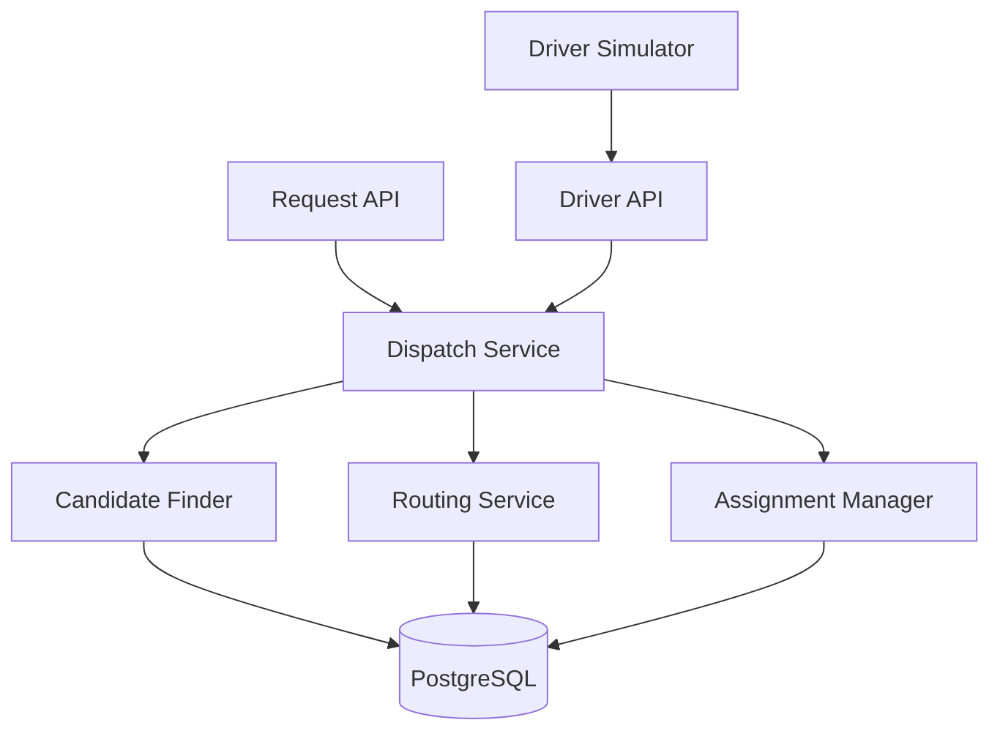
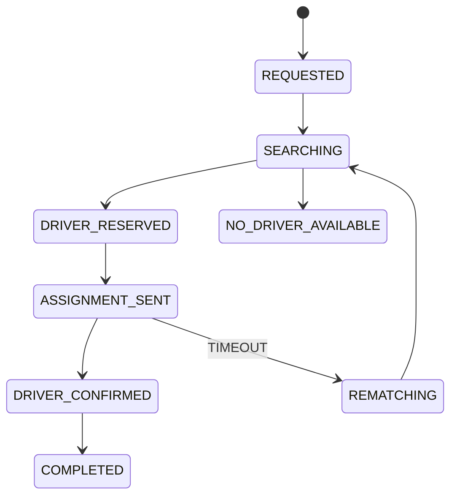
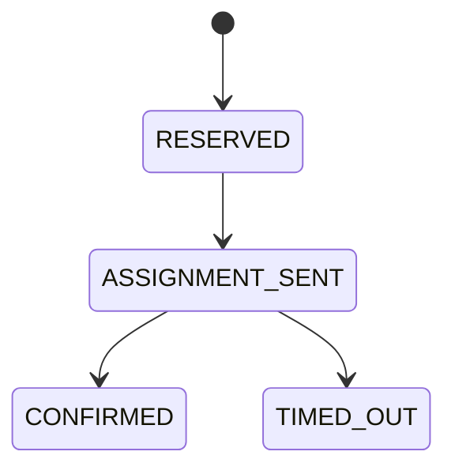
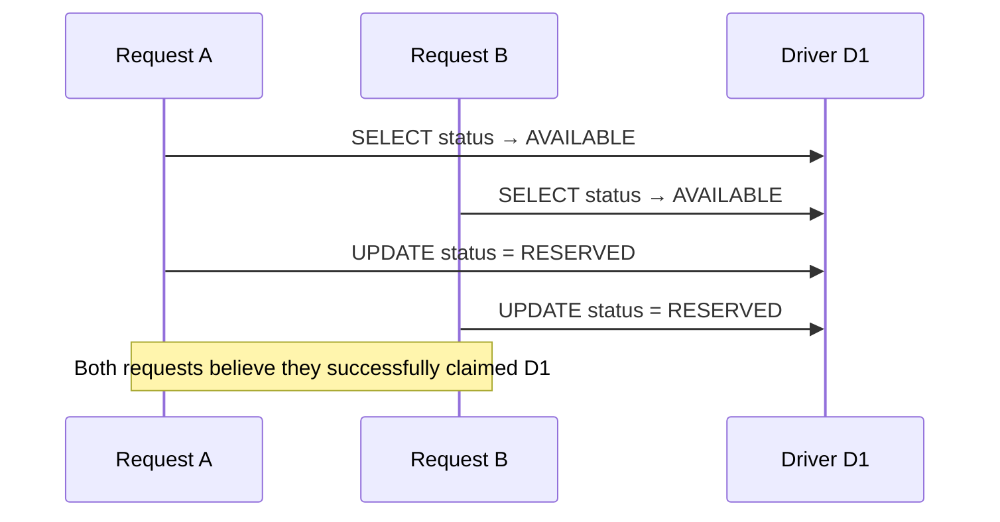
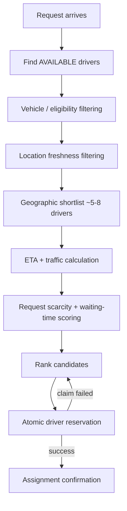
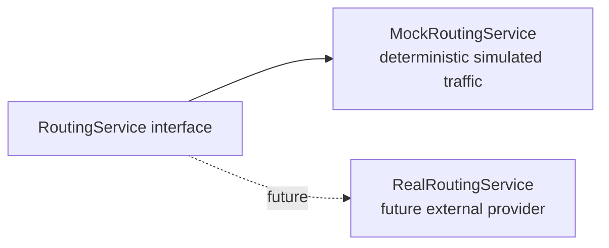
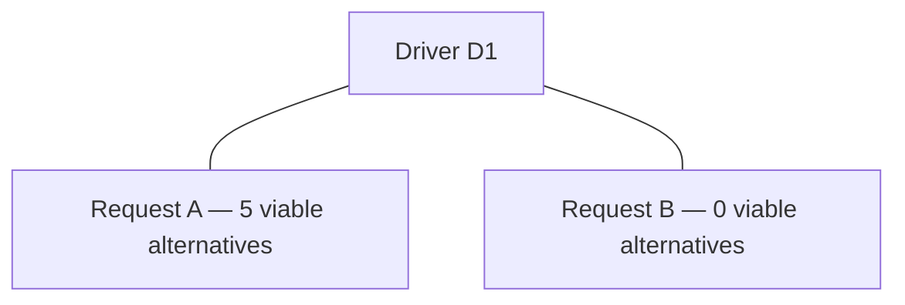
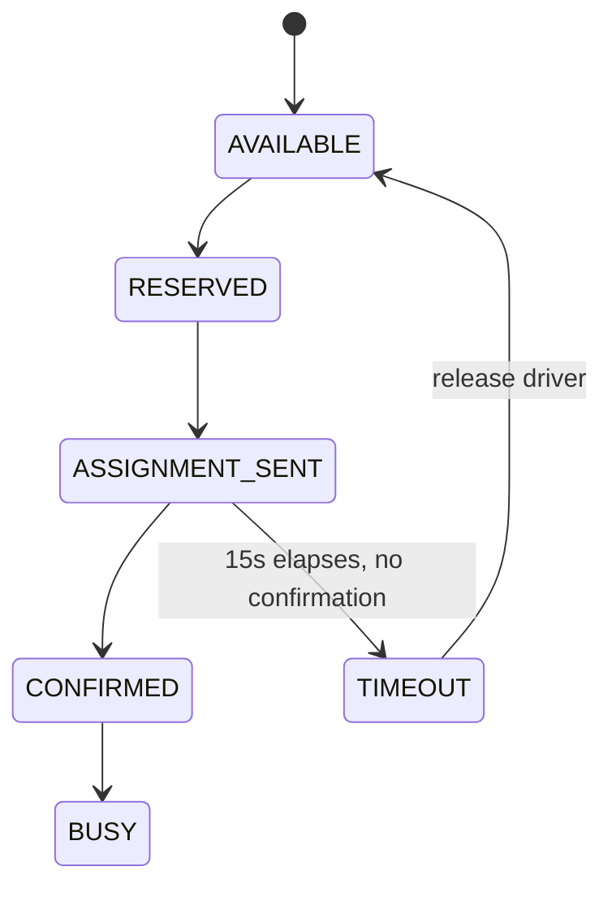
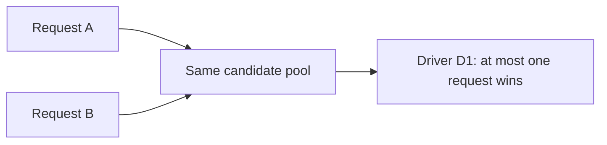

# Design Document — Dispatch Matching Service

**Day 1: Initial Architecture Submission**

> 📄 For a product-level summary, quickstart, and API overview, see the [README](../README.md).

This document is the engineering rationale behind the dispatch service: the problem framing, the architecture, the algorithms, and — most importantly — the trade-offs and alternatives that were considered and rejected. It represents the Day-1 architecture baseline; implementation proceeds from this design and may be refined as testing exposes new constraints, with changes tracked through Git history.

---

## Table of Contents

1. [Problem Interpretation](#1-problem-interpretation)
2. [Architecture](#2-architecture)
3. [Core Entities and State Machines](#3-core-entities-and-state-machines)
4. [Concurrency-Safe Assignment](#4-concurrency-safe-assignment)
5. [Matching Algorithm](#5-matching-algorithm)
6. [Traffic-Aware ETA](#6-traffic-aware-eta)
7. [Request Scarcity and Waiting-Time Prioritization](#7-request-scarcity-and-waiting-time-prioritization)
8. [Location Staleness](#8-location-staleness)
9. [Assignment Confirmation and Reassignment](#9-assignment-confirmation-and-reassignment)
10. [API Contract](#10-api-contract)
11. [Testing Strategy](#11-testing-strategy)
12. [Key Trade-Offs](#12-key-trade-offs)
13. [Failure Scenarios](#13-failure-scenarios)
14. [Implementation Roadmap](#14-implementation-roadmap)
15. [Future Improvements](#15-future-improvements)
16. [Day-1 Architecture Baseline](#16-day-1-architecture-baseline)

---

## 1. Problem Interpretation

This is a **concurrent resource-allocation problem**, not simply a "find the nearest driver" lookup.

Drivers are scarce, mutable resources. Requests can arrive concurrently, driver availability can change between matching and assignment, and driver location is a potentially stale snapshot rather than ground truth.

The system has three priorities, in strict order:

| Priority | Requirement |
|---|---|
| 1. Correctness | Never double-allocate a driver |
| 2. Liveness | A request must not remain stuck indefinitely |
| 3. Matching quality | Select a driver using ETA, traffic, freshness, and other useful signals |

Matching optimization is deliberately layered **on top of** the correctness guarantees — a better-scored match is never allowed to compromise safety or liveness.

---

## 2. Architecture

The proposed architecture is a **modular monolith**: one Spring Boot application, one PostgreSQL database.



**Module structure**

| Module | Responsibility |
|---|---|
| `controller/` | REST endpoints and DTO handling |
| `service/` | `DispatchService`, `DriverService`, `AssignmentService`, `RoutingService`, `ReassignmentService` |
| `repository/` | Persistence operations |
| `entity/` | `Driver`, `Vehicle`, `RideRequest`, `Assignment` |
| `dto/` | API request/response models |
| `exception/` | Domain exceptions and global error handling |
| `config/` | Configurable thresholds and scoring weights |
| `simulation/` | Standalone driver/request simulation |

**Why a modular monolith?**

The project does not require Kafka, Kubernetes, or independently deployed services. More importantly, keeping allocation state in one transactional PostgreSQL database makes the core concurrency guarantee **easier to reason about, implement, and test.** A distributed architecture would introduce additional coordination problems (distributed locks, eventual consistency, cross-service transactions) without providing a necessary benefit at this project's scale.

---

## 3. Core Entities and State Machines

**Driver** — possible states: `AVAILABLE`, `RESERVED`, `BUSY`, `OFFLINE`, `DISCONNECTED`.

**RideRequest**



**Assignment** — modeled as a **first-class entity**, not just a `driverId` attached to a request:



Making `Assignment` first-class gives it a natural place to store `reservedAt`, `expiresAt`, confirmation state, failure reason, and reassignment information — data that doesn't cleanly belong on `RideRequest` or `Driver` alone.

---

## 4. Concurrency-Safe Assignment

### The race condition

Two requests can simultaneously target the same driver:



If matching uses separate read and write operations, both requests observe `AVAILABLE` before either writes, and both believe they won the claim.

### Chosen solution: atomic conditional update

```sql
UPDATE driver
SET status = 'RESERVED'
WHERE id = :id
AND status = 'AVAILABLE';
```

The service checks the affected-row count:

| Result | Meaning |
|---|---|
| 1 row | Claim succeeded |
| 0 rows | Driver was already claimed or changed state |

If the claim fails, the service immediately attempts the next-ranked candidate. **The ranking algorithm does not provide the concurrency guarantee — the database state transition does.**

### Alternatives considered

| Alternative | Why not chosen |
|---|---|
| `SELECT FOR UPDATE` | Also solves the race, but locking every driver in a 5–8 candidate shortlist introduces unnecessary lock contention. The conditional update locks only the driver actually being claimed. |
| Optimistic locking (`@Version`) | Detects a conflicting update, but only *after* the matching attempt has already proceeded — the conflict is discovered too late to be useful for a "try next candidate" flow. |

The conditional update was chosen because it provides a single, simple claim operation that naturally supports the fallback-to-next-candidate behavior with minimal contention.

---

## 5. Matching Algorithm



**Stage 1 — Geographic filtering.** Filters on driver status, vehicle eligibility, location freshness, and geographic proximity. A bounding-box filter and Haversine distance cheaply identify nearby drivers. Approximately 5–8 candidates are shortlisted.

**Stage 2 — ETA-aware scoring.** Only shortlisted candidates proceed to routing/ETA evaluation. The score considers: ETA, traffic, distance, location freshness, vehicle compatibility, request scarcity, and waiting time. This avoids computing expensive routing information for *every* available driver.

### Matching quality vs. speed

Evaluating every driver could occasionally surface a geographically distant driver with a much better route — but it also increases latency and routing-service load linearly with fleet size. The two-stage approach deliberately **trades a small possibility of missing an ETA-favorable outlier for lower, more predictable matching latency.** Shortlist size is configurable, so this trade-off can be tuned without redesigning the pipeline.

---

## 6. Traffic-Aware ETA

The matching engine depends on a `RoutingService` abstraction rather than a concrete provider:



The initial implementation uses simulated traffic rather than an external routing API:

| Traffic condition | Factor |
|---|---|
| `LOW` | 1.0× |
| `MODERATE` | 1.25× |
| `HIGH` | 1.6× |

The system does not scrape Google Maps traffic visualization or call a real provider. A future routing implementation can supply real route duration and traffic-aware ETA through the **same** interface, with no change to the dispatch engine.

**Example:**

| Driver | Distance | Traffic | ETA |
|---|---|---|---|
| A | 2 km | HIGH | 14 min |
| B | 3.5 km | LOW | 8 min |

Driver B can be selected even though Driver A is geographically closer — this is the concrete behavior the routing abstraction exists to enable.

---

## 7. Request Scarcity and Waiting-Time Prioritization

### Request scarcity

The system considers how many viable alternative drivers are available to each competing request:



If both requests compete for D1, Request B can receive higher priority because it has fewer practical alternatives. This is intended to improve overall service quality, rather than simply rewarding whichever request happens to reach the matching engine first.

### Waiting-time protection

A request that has been waiting longer receives a configurable priority boost, reducing the possibility of starvation under a stream of newer, slightly-better-scored requests.

### Important separation of concerns

The scoring system decides **which request should receive priority**. The atomic reservation mechanism decides **whether a driver can actually be assigned**. Request scarcity therefore never overrides the concurrency guarantee — priority influences *who gets to try*, not *who wins the database claim*.

---

## 8. Location Staleness

Driver locations are evaluated using their `location_updated_at` timestamp against configurable thresholds:

| Location age | Classification | Behavior |
|---|---|---|
| < 10 seconds | `FRESH` | Normal ranking |
| 10–30 seconds | `SLIGHTLY_STALE` | Eligible, ranking penalty |
| > 30 seconds | `TOO_STALE` | Normally excluded |

This allows the system to tolerate minor communication delays without treating every stale update as a failure. These thresholds are project assumptions, not fixed constants, and can be changed through configuration.

---

## 9. Assignment Confirmation and Reassignment



On timeout (`ASSIGNMENT_SENT` → `TIMEOUT`): the driver is released, the request is requeued, and matching runs again. The timeout is intentionally short (15s) for demonstration purposes and will be configurable.

### The confirmation/timeout race

The reassignment process must also handle a race between a **late confirmation** and **timeout processing** — both can attempt to act on the same assignment near the deadline. Both transitions use **conditional state changes**, so that once one valid transition commits, the competing operation becomes a no-op instead of producing an invalid state (e.g. a confirmation "reviving" an assignment that has already been released and reassigned).

A **bounded retry policy** prevents a request from remaining in an endless reassignment loop.

---

## 10. API Contract

| Method | Endpoint |
|---|---|
| `POST` | `/drivers/{id}/location` |
| `PATCH` | `/drivers/{id}/status` |
| `POST` | `/requests` |
| `GET` | `/requests/{id}` |
| `POST` | `/assignments/{id}/confirm` |

DTOs are used at the API boundary; persistence entities are not serialized directly. This allows internal schema changes without unnecessarily changing the external API. Detailed request/response schemas will be implemented and documented during the implementation phase.

---

## 11. Testing Strategy

Testing uses PostgreSQL through **Testcontainers** for integration scenarios where database transaction behavior matters — an in-memory mock cannot reliably reproduce the guarantees the concurrency model depends on.

The single most important test is concurrent matching:



**Planned test categories**

Basic matching · ETA-aware ranking · traffic-aware ETA · vehicle compatibility · availability filtering · location freshness · request scarcity · waiting-time prioritization · concurrent assignment · timeout · automatic reassignment · duplicate confirmation · late confirmation after timeout.

The concurrency test uses explicit thread coordination (e.g. `CountDownLatch`) to ensure matching attempts genuinely overlap rather than executing sequentially by accident.

---

## 12. Key Trade-Offs

| Decision | Chosen approach | Reason |
|---|---|---|
| Architecture | Modular monolith | Simple transactional model |
| Database | PostgreSQL | Strong transactional guarantees |
| Driver claim | Atomic conditional update | Simple, safe, low contention |
| Candidate selection | Two-stage | Lower matching latency |
| ETA | Routing abstraction | Traffic-aware without external dependency |
| Traffic | Deterministic mock initially | Reproducible demos and tests |
| Staleness | Penalty + threshold | Graceful handling of delayed data |
| Scarcity | Secondary ranking signal | Protect requests with few alternatives |
| Waiting time | Priority boost | Reduce starvation |
| Updates | REST + polling initially | Lower implementation complexity |
| Real-time push | Deferred WebSockets | Not required for core correctness |
| Distributed services | Deferred | No concrete requirement at current scale |

---

## 13. Failure Scenarios

| Scenario | What happens | Action taken |
|---|---|---|
| Driver becomes unavailable before claiming | Atomic reservation returns zero affected rows | Try the next candidate |
| Driver disappears after reservation | Assignment expires | Release the driver, rematch the request |
| Location becomes stale | Driver receives a freshness penalty or is excluded, by age | Continue matching with reliable candidates where possible |
| Two requests compete for one driver | Only one atomic reservation succeeds | The other request continues to its next candidate or is rematched |
| Confirmation arrives after timeout | Assignment has already transitioned out of its confirmable state | Late confirmation is rejected/idempotently ignored |
| No suitable driver exists | Request enters a controlled no-driver/retry state | Retry per configured policy, rather than hanging indefinitely |

---

## 14. Implementation Roadmap

| Day | Focus |
|---|---|
| **1** | Architecture, README, design document, GitHub repository, project structure |
| **2** | Spring Boot foundation, PostgreSQL, Flyway, core entities, driver APIs, request API |
| **3** | Candidate filtering, ETA, traffic simulation, freshness scoring, scarcity scoring, waiting-time scoring, atomic reservation, confirmation |
| **4** | Timeout processing, reassignment, driver simulator, concurrency tests, failure scenario tests |
| **5** | Demo dashboard (if time permits), API documentation, test results, README refinement, demo preparation, future improvements |

---

## 15. Future Improvements

Potential future extensions, deliberately out of scope for the current implementation:

Real traffic-aware routing provider · WebSocket live updates · Redis/geospatial indexing for larger driver pools · multi-region dispatch · distributed event processing · more advanced global matching optimization · ML-based ETA prediction · production observability · authentication and authorization · ratings and marketplace features · dynamic pricing.

These are intentionally deferred so the initial implementation stays focused on concurrency correctness, reliable reassignment, and explainable matching.

---

## 16. Day-1 Architecture Baseline

This document represents the **initial architecture baseline** for the project. Implementation will proceed from this design during the remaining training period. Design decisions may be refined when implementation and testing expose new constraints, with changes documented through Git history and updated project documentation.

---

📄 Back to [README](../README.md)
